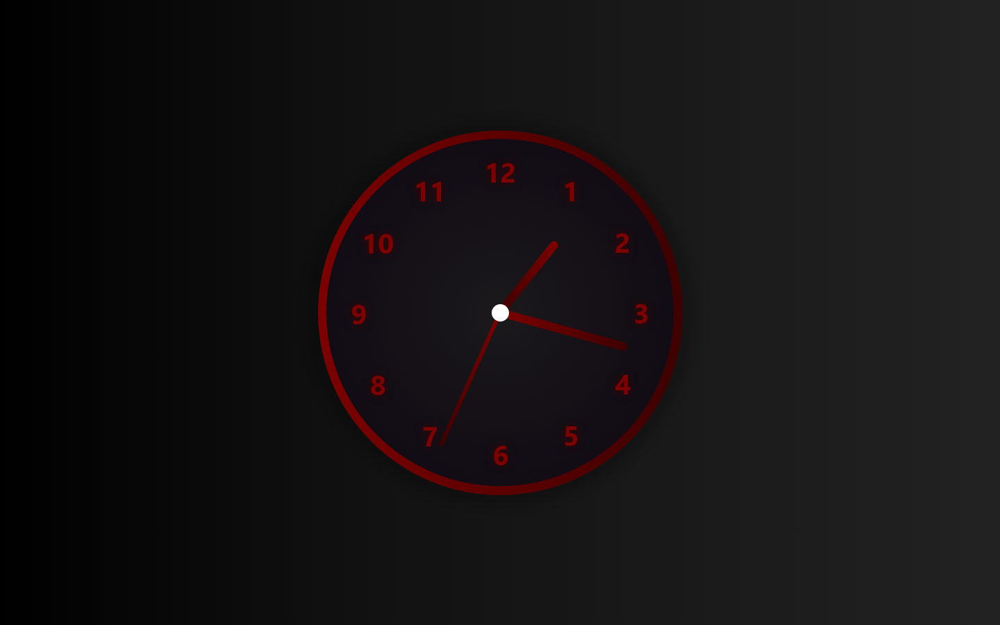
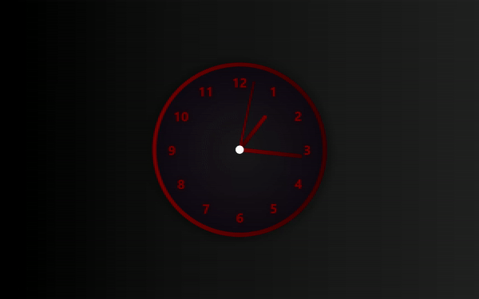

# Analog Clock
This is an Analog Clock using HTML for the hands and numbers, CSS for the layout, and JavaScript for the functionality.

  

## Getting started
- Get the code:
    ```
    git clone https://github.com/JheyluisReyes/AnalogClock.git
    ```

- Open [index.html](index.html) with your preferred browser to view the Animated Background.

  
